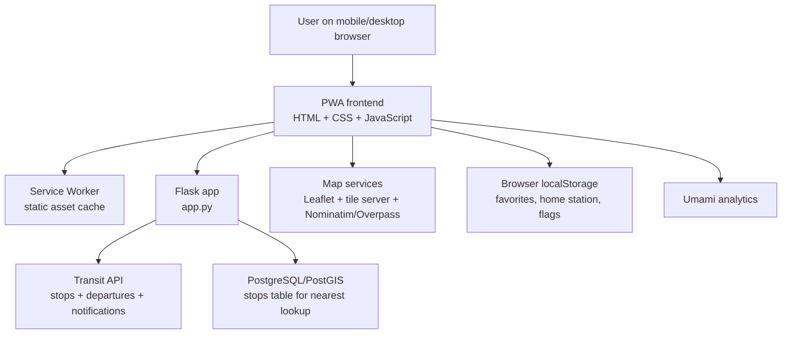
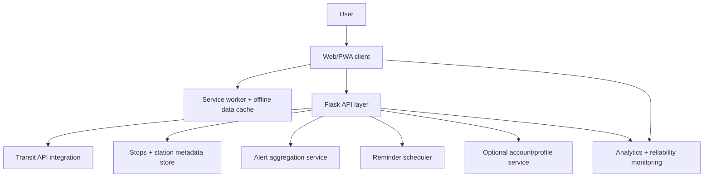

# KVV Tracker Webapp Goals, Architecture, and Roadmap

## 1. Current Product Analysis

### Current purpose
KVV Tracker Webapp is a Flask-based Progressive Web App for checking live departures for KVV transit stops. It already combines a lightweight backend with a richer browser-side experience for quick station lookup, saved stations, map-based stop selection, filtering, and development/debug workflows.

### Current user-facing capabilities
- Search stops by name and by stop ID
- View live departures with line colors and delay states
- View current service notifications per stop
- Save favorites and a home station in browser storage
- Use a map tab to find nearby stops
- Locate the nearest station using browser geolocation
- Install the app as a PWA with cached static assets
- Use dark/light theme support
- Enable experimental features in the client
- Use development/debug tools for override testing

### Current strengths
- Fast and simple architecture
- Very low operational complexity
- Good mobile fit because of PWA support
- Existing personalization foundations through local storage
- Strong base for adding alerting, dashboard, and accessibility features

### Current constraints
- Backend is a single Flask application file, so feature growth should be organized carefully
- Most client state lives in local storage, which limits cross-device sync
- Offline support currently focuses on static asset caching rather than robust data fallback
- Notification and reminder logic is not yet implemented end-to-end
- Map stop lookup depends on PostgreSQL/PostGIS configuration for nearest-stop queries

---

## 2. Product Goals

### Primary goals
1. **Reduce commuter friction** by making live departures faster to access and easier to understand.
2. **Improve rider confidence** through clearer service alerts, disruption handling, and accessibility information.
3. **Increase daily retention** with personalized views such as dashboards, reminders, and smarter favorites.
4. **Preserve app simplicity** by shipping features in small, maintainable milestones.

### Success indicators
- Faster repeat access to relevant stations
- Higher usage of favorites, home station, and map lookup
- Lower abandonment when service disruptions occur
- Higher PWA installs and return visits
- Fewer support questions caused by unclear delays or stop selection

---

## 3. Future Feature Opportunities

| Feature | What it adds | Core requirements | Primary use cases | Importance |
| --- | --- | --- | --- | --- |
| Service alerts and disruption center | Show stop-specific and line-specific disruptions in a more actionable format | Normalize notifications, severity labels, alert history rules, dismiss state, better UI grouping | Riders need to know whether to wait, reroute, or walk to another stop | **Critical** |
| Departure reminders / “leave now” alerts | Notify riders when it is time to leave for a chosen departure | Push notification permission flow, reminder scheduling, walking-time input, favorite stop integration | A commuter wants a reminder 5–10 minutes before departure | **Critical** |
| Multi-station dashboard | One screen showing multiple favorite stations and key lines | Dashboard layout, parallel data refresh, compact departure cards, persistence for selected stations | Commuters watch home, work, and interchange stops together | **High** |
| Accessibility and elevator status | Surface wheelchair relevance, elevator outages, and step-free hints | Accessibility data source, station metadata model, UI badges, filters, fallback content | Mobility-impaired riders need dependable path planning | **High** |
| Line-centric delay summary | Aggregate delays and service quality by line | Line grouping logic, summary widgets, optional trend calculation | Riders follow one or two lines more than a stop overall | **High** |
| Offline “last known departures” fallback | Show recently cached departures when the network fails | Cache policy, freshness timestamps, offline UI state, stale-data warnings | Users in tunnels or weak-signal areas still need reference data | **Medium-High** |
| Shared deep links and saved views | Share a stop, filter set, or dashboard layout directly | Stable URL state, dashboard serialization, copy/share UX | Users share useful stop boards with family or coworkers | **Medium** |
| Account sync (optional) | Sync favorites and reminders across devices | Auth strategy, user profiles, secure storage, migration plan | Frequent riders use both phone and desktop | **Medium** |
| Analytics and reliability dashboard | Measure usage and errors to guide roadmap decisions | Event taxonomy, privacy review, operational dashboard, alerting | Maintainers want better release confidence and feature prioritization | **Medium** |

---

## 4. Recommended Prioritization

### Tier 1: Ship next
1. Service alerts and disruption center
2. Departure reminders / leave-now alerts
3. Multi-station dashboard

### Tier 2: Build after the core experience is stronger
4. Accessibility and elevator status
5. Line-centric delay summary
6. Offline last-known-departures fallback

### Tier 3: Scale and polish
7. Shared deep links and saved views
8. Account sync
9. Analytics and reliability dashboard

Why this order:
- Tier 1 creates the biggest daily-user value with the smallest conceptual gap from the current product.
- Tier 2 builds better resilience and inclusivity after the main personalization flows are stronger.
- Tier 3 adds platform maturity once there is enough stable product usage to justify the added complexity.

---

## 5. Full System Architecture

### Current architecture summary
- **Frontend:** Single-page style HTML/CSS/JavaScript app served by Flask
- **Backend:** Flask routes serving the main page, static PWA assets, stop search, departures, notifications, coordinate lookup, and debug APIs
- **External data sources:** Transit API for stop/departure/notification data, Nominatim and Overpass-based map lookups, tile servers for maps
- **Data storage:** Browser local storage for favorites, home station, debug settings, experimental flags; PostgreSQL/PostGIS for nearest-stop lookup
- **Delivery:** Local Python execution or Docker container

### Current logical architecture

### Suggested target architecture for future updates

### Architecture implications by feature
- **Alerts/disruptions** need a clearer backend response contract and frontend grouping model.
- **Reminders** likely need either browser notifications only for an MVP or a backend scheduler for reliable future delivery.
- **Dashboard** increases frontend state and refresh complexity but can reuse current stop endpoints.
- **Accessibility** benefits from a structured metadata source separate from the raw departure feed.
- **Offline fallback** needs cached API responses, freshness metadata, and stale-state UI messaging.
- **Account sync** should be deferred until the local-first model is stable and worth syncing.

---

## 6. Milestones and Implementation Steps

### Milestone 1 — Alert-aware departure experience
**Goal:** Make disruption information impossible to miss and easier to act on.

### Scope
- Improve alert presentation
- Group alerts by severity and affected stop/line
- Persist dismiss state locally
- Expose clearer API-ready alert objects in the client

### Implementation steps
1. Audit current notification payloads returned from the transit API.
2. Define a frontend alert model with severity, title, details, affected lines, and timestamp.
3. Refactor notification rendering to support grouped and expandable alerts.
4. Add alert badges to departure cards and station header when relevant.
5. Store dismissed alert IDs locally to reduce repeat noise.
6. Add fallback behavior when notifications are unavailable.
7. Validate on mobile layout and PWA install mode.

### Why it matters
This directly improves trust in the app during disruptions and delivers the highest user value with limited backend changes.

### Milestone 2 — Reminder MVP
**Goal:** Help riders catch departures without continuously checking the app.

### Scope
- Add reminder creation from a departure card
- Support browser permission flow
- Trigger local notifications for selected departures

### Implementation steps
1. Add a “remind me” interaction on departure cards.
2. Capture reminder offsets such as 5, 10, or 15 minutes.
3. Store reminder definitions safely in local storage for MVP.
4. Integrate browser Notifications API and permission handling.
5. Handle schedule drift when departure delays change.
6. Show reminder status in the station screen and dashboard.
7. Document browser support and fallback behavior.

### Why it matters
This turns the app from a passive board into an active commute assistant.

### Milestone 3 — Multi-station dashboard
**Goal:** Create a default home screen for frequent riders.

### Scope
- Add a dashboard view for favorites and home station
- Show compact departures across several stops
- Support configurable station order and pinning

### Implementation steps
1. Design a dashboard route/view and card layout.
2. Reuse current stop-by-ID loading for multiple stations in parallel.
3. Add per-card filters for lines or vehicle types.
4. Allow drag/reorder or move-up/down controls.
5. Add refresh coordination and error isolation by card.
6. Persist dashboard settings in local storage.
7. Add URL support for shareable dashboard views if feasible.

### Why it matters
This is likely the biggest retention feature for repeat users.

### Milestone 4 — Accessibility and rider confidence
**Goal:** Make the app more inclusive and more dependable for planning.

### Scope
- Add accessibility metadata
- Improve wheelchair and station access signals
- Introduce clearer route viability indicators

### Implementation steps
1. Identify available accessibility and elevator-status data sources.
2. Extend the station/departure model with accessibility metadata.
3. Add accessibility badges and filters to station and dashboard views.
4. Surface degraded-access alerts prominently.
5. Define fallback copy when metadata is missing.
6. Validate contrast, keyboard navigation, and touch targets.

### Why it matters
This expands the app’s usefulness to riders who face the highest planning risk.

### Milestone 5 — Offline resilience and reliability
**Goal:** Keep the app useful when connectivity is unstable.

### Scope
- Cache last successful departure results
- Show freshness timestamps and stale warnings
- Improve operational visibility

### Implementation steps
1. Extend the service worker strategy beyond static assets.
2. Cache recent station responses with timestamps.
3. Show a stale-data banner when cached departures are displayed.
4. Protect against serving very old data silently.
5. Track fetch failures and fallback usage for maintenance insight.
6. Review cache size and invalidation policy.

### Why it matters
Transit use often happens in poor-network environments, so resilience improves real-world usefulness immediately.

---

## 7. GitHub Issues Roadmap

The following issues can be created as the implementation backlog.

### Epic 1: Alert and disruption improvements
1. **Create normalized client-side notification model**
   - Labels: `enhancement`, `frontend`, `alerts`
   - Deliverable: one mapping layer from raw notification payloads to a stable UI shape
   - Acceptance notes: unsupported payloads fail gracefully

2. **Redesign station alert banner with severity and grouping**
   - Labels: `enhancement`, `frontend`, `ux`
   - Deliverable: grouped alert UI with clear severity colors and expand/collapse behavior
   - Acceptance notes: alerts remain readable on mobile widths

3. **Add local dismiss/snooze behavior for repeated alerts**
   - Labels: `enhancement`, `frontend`, `persistence`
   - Deliverable: dismissed alerts stay hidden until they materially change
   - Acceptance notes: no hidden alert should suppress a newly updated disruption

### Epic 2: Reminder MVP
4. **Add departure-card action for reminder creation**
   - Labels: `enhancement`, `frontend`, `notifications`
   - Deliverable: reminder action with offset selector
   - Acceptance notes: available only when browser support exists

5. **Integrate browser notification permissions and reminder storage**
   - Labels: `enhancement`, `frontend`, `notifications`
   - Deliverable: permission flow plus local persistence for reminders
   - Acceptance notes: denied permissions show a clear fallback message

6. **Handle delay updates for active reminders**
   - Labels: `enhancement`, `logic`, `notifications`
   - Deliverable: reminder timing adjusts when departure times move
   - Acceptance notes: reminders avoid duplicate or stale notifications

### Epic 3: Dashboard
7. **Create multi-station dashboard route and layout**
   - Labels: `enhancement`, `frontend`, `dashboard`
   - Deliverable: dashboard page with favorite/home cards
   - Acceptance notes: empty state explains how to populate the dashboard

8. **Load and refresh multiple favorite stations concurrently**
   - Labels: `enhancement`, `frontend`, `performance`
   - Deliverable: coordinated polling with per-card loading and error states
   - Acceptance notes: one failed card does not break the whole dashboard

9. **Persist dashboard ordering and quick filters**
   - Labels: `enhancement`, `frontend`, `persistence`
   - Deliverable: saved order and per-card preferences
   - Acceptance notes: settings survive page reload and PWA restart

### Epic 4: Accessibility
10. **Research and add station accessibility metadata source**
    - Labels: `research`, `backend`, `accessibility`
    - Deliverable: documented source and proposed schema
    - Acceptance notes: include fallback plan if live data is incomplete

11. **Display accessibility status and elevator-related disruptions**
    - Labels: `enhancement`, `frontend`, `accessibility`
    - Deliverable: badges and warnings in station and dashboard views
    - Acceptance notes: icon-only states must also include text or aria labels

### Epic 5: Offline resilience
12. **Cache last successful station responses for offline fallback**
    - Labels: `enhancement`, `pwa`, `offline`
    - Deliverable: response cache with freshness timestamp
    - Acceptance notes: stale data is clearly labeled

13. **Add offline status banner and stale-data UX**
    - Labels: `enhancement`, `frontend`, `offline`
    - Deliverable: user-visible offline/fallback state
    - Acceptance notes: users can distinguish live vs cached data instantly

### Epic 6: Product maturity
14. **Add line-level summary widgets for favorite lines**
    - Labels: `enhancement`, `frontend`, `analytics`
    - Deliverable: compact line summary cards
    - Acceptance notes: summaries should not obscure raw departures

15. **Define analytics events and reliability metrics dashboard**
    - Labels: `research`, `ops`, `analytics`
    - Deliverable: event taxonomy and reporting dashboard proposal
    - Acceptance notes: privacy and retention considerations are documented

16. **Evaluate optional account sync for favorites and reminders**
    - Labels: `research`, `backend`, `product`
    - Deliverable: architecture decision record for sync vs local-only
    - Acceptance notes: includes auth, security, migration, and maintenance costs

---

## 8. Additional Notes

- The current app already has a good local-first foundation, so the roadmap should preserve quick startup and low friction.
- The single-file Flask backend is acceptable today, but milestone work should avoid turning `app.py` into an unstructured monolith.
- The highest-value roadmap items can be delivered without introducing full user accounts.
- A browser-only MVP for reminders is the best first step because it keeps the architecture simple.
- Accessibility work should be treated as a product feature, not just a UI polish task.
- Offline fallback must always communicate freshness to avoid misleading riders.

---

## 9. Notes at the End

Recommended next action:
1. Review and approve the milestone order.
2. Convert the GitHub issue roadmap section into actual repository issues.
3. Start with Milestone 1 and keep implementation small enough to validate with real users before expanding scope.

This document is intended to be a practical planning baseline. It should be updated after each milestone ships so prioritization continues to reflect actual rider usage and technical learnings.
